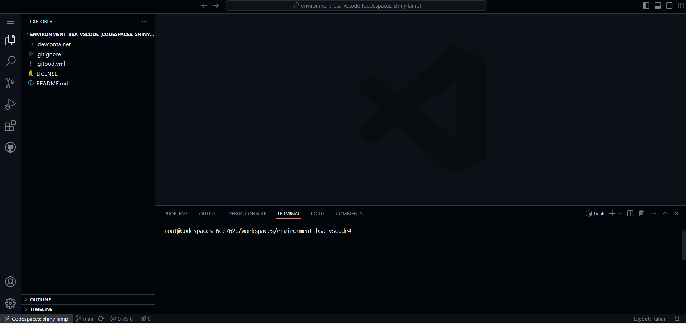

# VScode Server - Bioinformatics course

This is a no-content repository, with the sole purpose of facilitating the launch of a VScode environment provisioned through a Docker image and run using either [GitHub CodeSpaces](https://docs.github.com/en/codespaces/overview) or [Gitpod](https://www.gitpod.io/docs/introduction).

## GitHub CodeSpaces

### 1. Pre-requirements

In order to make the CodeSpace work, you should have a GitHub account: if you don't have one, sign up to GitHub [here](https://github.com/signup).

### 2. Launch the Space

Click the  `<> Code` button on the top right, selecting `Codespaces` and then `Create codespace on main`, as you can see in the animation here:

After a while, you should land to an environment that looks like this:

And you're all set!

## GitPod Workspaces

### 1. Pre-requirements

In order to run this space with GitPod, please make sure:

1. You have a GitHub account: if not, create one [here](https://github.com/signup)
2. Once you have a GitHub account, sign up for GitPod using your GitHub user [here](https://gitpod.io/login/) choosing "continue with GitHub".

### 2. Launch the workspace in GitPod

Now you're all set and can use the following button to launch the service.

Just click on "Continue (ctrl + enter)" to go on with the workspace set up.

When the Workspace is ready, you'll see a similar environment as for CodeSpaces, probably in light theme.